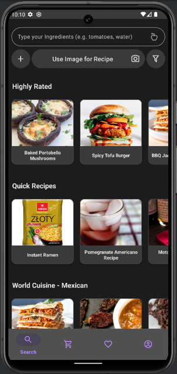
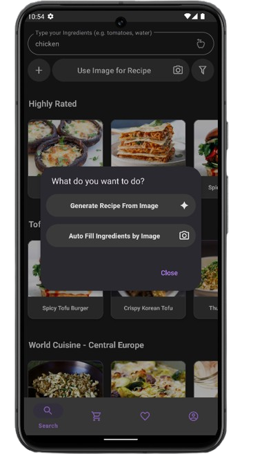
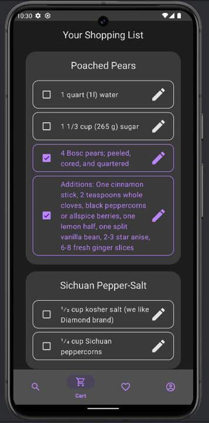
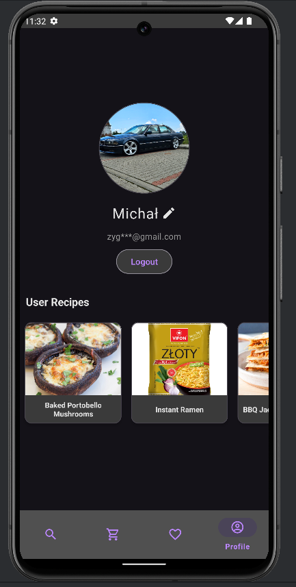

# TasteShare

**TasteShare** is a multi-screen Android application focused on recipe discovery and user-driven cooking workflows.  
The app combines external recipe search, Firebase-backed user features, and AI-assisted recipe generation in one cohesive product.  
It demonstrates practical end-to-end mobile development: authentication, data flow, API integration, and polished UI navigation.

## Features

- **User authentication** with Firebase (email/password, email verification, password reset, Google sign-in)
- **Recipe search and filtering** (diet, health, cuisine, meal type, dish type, max time) via Edamam API
- **AI recipe generation** integrated with Google Generative AI
- **Recipe details experience** with ingredients, metadata, instructions handling, comments, and ratings
- **Favorites management** stored per user in Firestore
- **Shopping list workflow** with recipe-based ingredient tracking
- **Profile management** (username edit, avatar upload/remove, user recipe listing)
- **Onboarding + bottom navigation** for guided first use and clear app structure

## Tech Stack

- **Kotlin** (Android)
- **Firebase** (Auth, Firestore, Storage, Analytics)
- **Retrofit + Gson + OkHttp** (networking)
- **Google Generative AI SDK**
- **Material Components**, **RecyclerView**, **ViewPager2**
- **Glide**, **WebView**, **Jsoup**
- **Gradle KTS**, **Android Gradle Plugin**

## Project Structure

- `app/` — Android application module
- `app/src/main/java/com/example/tasteshare/` — activities, adapters, models, API integration
- `app/src/main/res/` — layouts, strings, drawables, styles, and UI resources
- `app/src/androidTest/` — instrumentation tests
- `app/src/test/` — unit tests
- `gradle/` — wrapper and version catalog configuration
- `build.gradle.kts` — root build setup
- `settings.gradle.kts` — project/module configuration
- `app/build.gradle.kts` — app dependencies and Android config

## Smartphone & Tablet

  

## Screenshots Portrait

<table>
  <tr>
    <th>Main Screen</th>
    <th>Gemini</th>
    <th>Shopping List</th>
    <th>Profile</th>
  </tr>
  <tr>
    <td></td>
    <td></td>
    <td></td>
    <td></td>
  </tr>
</table>

## 🎥 Demo

https://raw.githubusercontent.com/Michal4566/Taste-Share/main/demo/TasteShare.mp4

## Learning Goals

- Building a **production-style Android app** with multiple connected screens
- Implementing **Firebase authentication and user data architecture**
- Integrating **third-party APIs** and handling external data in UI flows
- Designing **feature modules** (search, profile, favorites, shopping list, details)
- Improving **UX consistency** through onboarding and bottom navigation
